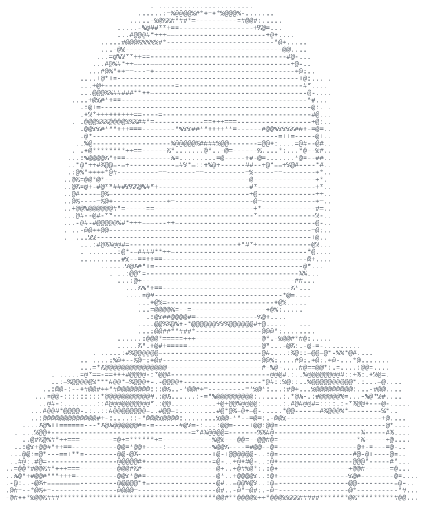

<table>
  <tr>
    <td width="44%" align="center">
      

        <h1>Mohamed Aziz Sridi</h1>
        
      

    </td>
    <td width="56%" valign="middle">
      <h3>Software Engineer | Mobile Developer | AI &amp; Data Science Engineer</h3>
      
Computer Science graduate from Tunisia, currently pursuing an engineering degree in Data Science and Machine Learning.

      

        
        
      

    </td>
  </tr>
</table>

---

## Overview

I am interested in mobile development, software engineering, machine learning, and computer vision.

---

## Top Skills

### Mobile Development

### Machine Learning & AI

### Programming Languages

### Frontend Development

### Backend, APIs & Databases

### Tools & OS

### Other Technologies

REST APIs · SQL · JSON · SLAM · Clean Architecture · Mobile UI/UX · Google Classroom integration
