  <picture>
    <source media="(max-width: 600px) and (prefers-color-scheme: dark)" srcset="./assets/saitama-intro-mobile-dark.svg" />
    <source media="(max-width: 600px)" srcset="./assets/saitama-intro-mobile.svg" />
    <source media="(prefers-color-scheme: dark)" srcset="./assets/saitama-intro-dark.svg" />
    
  </picture>

   &nbsp; / &nbsp;
  

<h1 align="center">Mohamed Aziz Sridi</h1>

AI &amp; Machine Learning engineering student

<strong>Seeking an AI internship · Based in Tunisia</strong>

## About

I'm a final-year Data Science and Machine Learning engineering student in Tunisia, looking for an AI internship.

I work mainly with Python, TensorFlow, and OpenCV. I'm interested in computer vision and SLAM, and I build mobile and web apps for fun.

## Stack

- **AI & machine learning:** Python, TensorFlow, OpenCV

  

- **Frontend:** React, JavaScript, HTML, CSS, Bootstrap

  

- **Backend & APIs:** Firebase, Supabase, REST APIs, JSON

  

- **Databases:** MySQL, PostgreSQL, SQL

  

- **Mobile:** Flutter, Dart, Android Studio

  

- **Other languages:** C++, Java

  

- **Tools:** Git, GitHub, Linux, Figma, VS Code, Postman

  

 

  <picture>
    <source media="(prefers-color-scheme: dark)" srcset="./assets/one-punch-commits-dark.svg" />
    
  </picture>

<a href="./assets/saitama/CREDITS.md">Sprite credits</a>

## Connect

   &nbsp; / &nbsp;
   &nbsp; / &nbsp;
  <a href="https://github.com/aziz-sridi?tab=repositories"> Explore my repositories</a>

